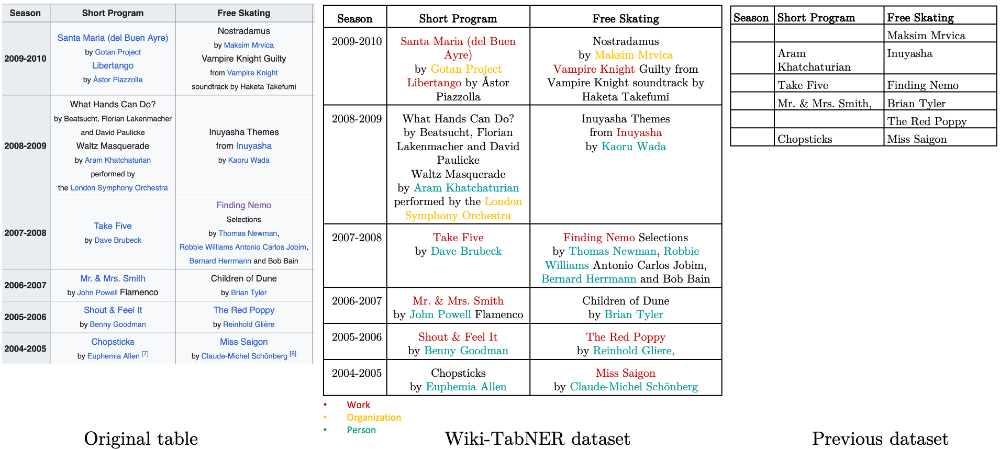

# Wiki-TabNER

This repository contains the dataset and the code for the paper [Wiki-TabNER:Advancing Table Interpretation Through Named
Entity Recognition](https://arxiv.org/abs/2403.04577).

Motivated by the simpler tables commonly used for table interpretation tasks, we propose a new dataset annotated with NERs within tables. 
 
Here is an example table how the tables in the Wiki-TabNER dataset are annotated. 

For the annotations of the entities we used the existing links between WIkipedia pages and Dbpedia entities.
We used the following entities types: <em> Activity, Organisation, Architectural Structure, Event, Place, Person and Work</em>. 

The dataset contains 51 271 tables annotated entities with BIO-labels and span-based labels. 
The labels have been extracted from Dbpedia and Yago. It can be downloaded from [here](https://zenodo.org/records/10794526).
Here, we also provide the file with the ground truth needed for the evaluation of the entity linking task.

The evaluation of the LLMs is in the [ner_prompting.py]() file. In order to run the evaluation of the Open-AI models, 
a configuration of the parameters is required. 